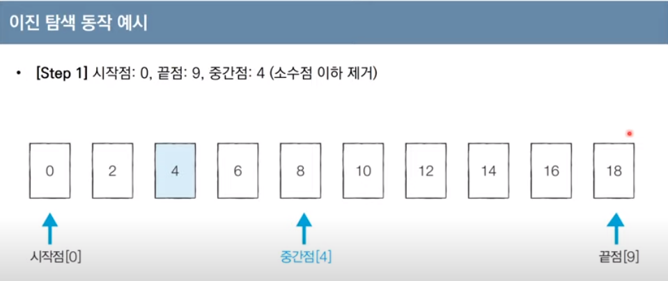
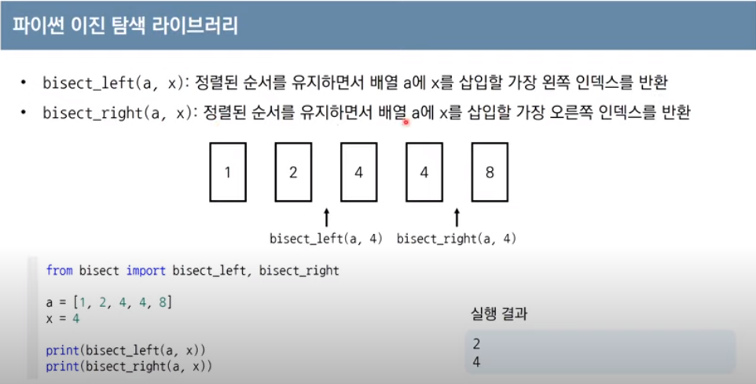
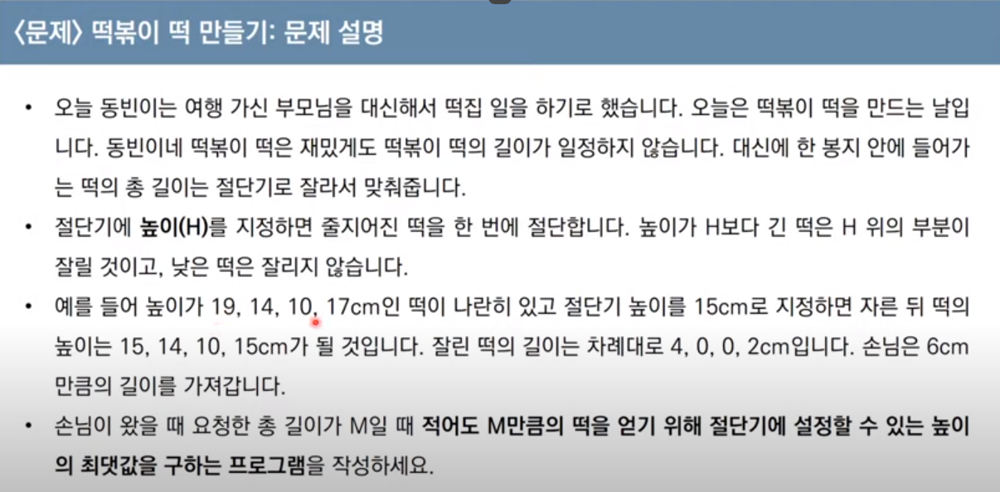
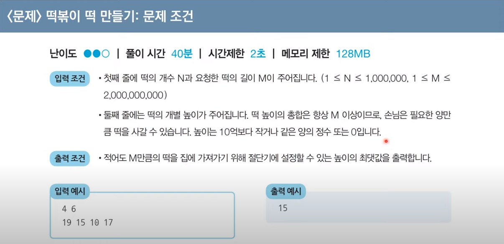
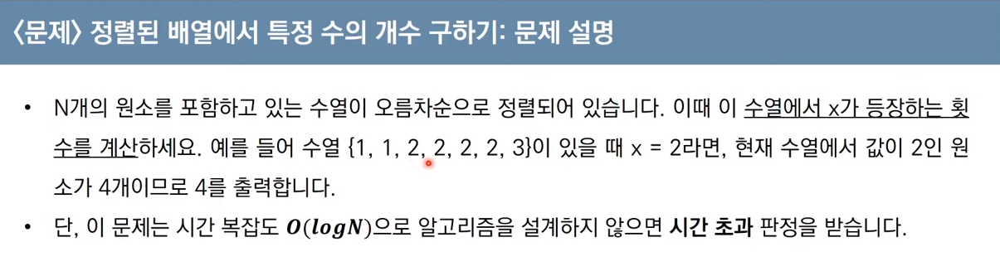
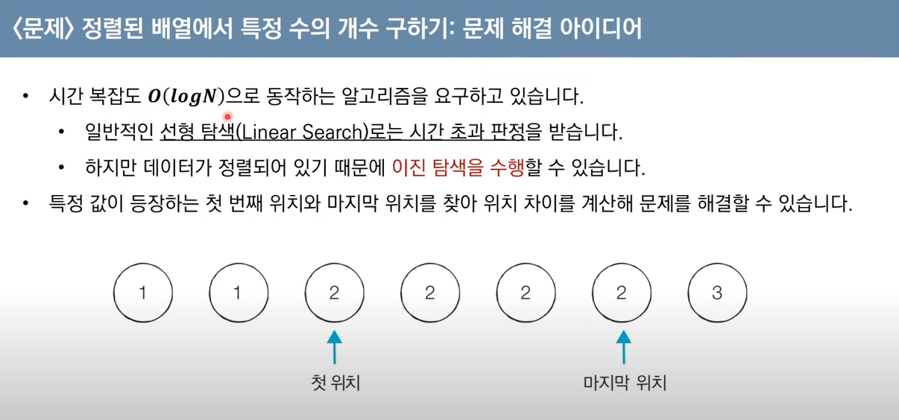

### 이진탐색
#### 순차탐색 : 리스트 안에 있는 특정 데이터를 찾기 위해 앞에서부터 데이터를 하나씩 확인하는 방법
#### 이진탐색 : 정렬된 리스트에서 탐색 범위를 절반씩 좁혀가면서 데이터를 탐색하는 방법
- 이진 탐색은 시작점, 끝점, 중간점을 이용해 탐색 범위를 설정한다.
- 중간점보다 크고 작음을 통해 1 / 2로 범위를 좁혀가며 탐색하기 때문에 시간 복잡도는 O(Log N)을 보장한다.

```python
# 배열, 찾을 값, 시작값, 마지막 값
def binary_search(array, target, start, end):
    if start > end: # 만약 시작값이 마지막 값 보다 크다면 원소가 없거나 정렬되지 않은 배열임
        return None
    
    # 중간값을 지정하고
    mid = (start + end) // 2
    
    # 만약 중간값이 찾아야 할 값 이라면
    if array[mid] == target:
        return target # 이 값을 return
    
    # 만약 중간 값이 찾아야 할 값 보다 크다면
    elif array[mid] > target: # 중간값 기준 왼쪽만 찾으면 된다.
        binary_search(array, target, start, mid - 1)
        
    # 만약 중간 값이 찾아야 할 값 보다 작다면    
    else: # 중간값 기준 오른쪽만 찾으면 된다.
        binary_search(array, target, start, mid + 1)

# 라이브러리
# from bisect import bisect_right, bisect_left
# bisect_right(a, x) : 정렬 된 순서를 유지하면서 배열 a에 x를 삽입 할 가장 오른쪽 인덱스를 반환한다.
# bisect_left(a, x) : 정렬 된 순서를 유지하면서 배열 a에 x를 삽입 할 가장 왼쪽 인덱스를 반환한다.
```



---

### Parametric Search, 파라메트릭 서치
#### 최적화 문제를 결정 문제로 바꾸어 해결하는 기법
- 최적화 된 값을 구할 때 예 / 아니오로 바꿔 값을 빠르게 찾는다.
- 일반적으로 이진탐색을 활용해 해결하는 기법




```python
def binary_search():
    n, m = 4, 6 # 최대 갯수와 최소 길이
    arr = [19, 15, 10, 17] # 리스트를 입력받는다.
    # [10, 15, 17, 19]
    arr.sort() # 이진탐색을 위해 리스트를 정렬한다.

    start, end = 0, max(arr) # 시작은 0부터 마지막 값 까지
    result = 0 # 결과를 저장 할 값

    while(start <= end):
        
        # 떡을 자른 합계를 저장 할 값
        sum = 0
        mid = (start + end) // 2 # 가운데 값을 설정하고

        for i in arr: # 주어진 배열을 돌면서
            if i > mid: # 만약 현재 값이 중간 값 보다 작아서 떡을 자를 수 있다면
                sum += i - mid # 자른만큼 값을 더한다.

        if sum < m: # 반복을 다 돌고 만약 자른 값이 최소 길이보다 작으면
            end = mid - 1 # 중간 값 이후 오른쪽 값은 모두 날려 범위를 반으로 즐인다.
        else: # 최소 길이보다 합계가 크면
            result = mid # 최대한 덜 잘라야 하므로 결과인 result에 값을 기록하고
            start = mid + 1 # 중간 값 이전 왼쪽 값은 모두 날려 범위를 반으로 줄인다.

    print(result)
```

---




```python
from bisect import bisect_left, bisect_right

def bisect_search():
    arr = [1, 1, 2, 2, 2, 2, 3]

    def count(arr, a, b):
        end = bisect_right(arr, a)
        start = bisect_left(arr, b)
        return end - start

    result = count(arr, 2, 2)
    if result == 0:
        print(-1)
    else:
        print(result)
```

---

### 이진 탐색 템플릿
- 이진 탐색과 파라메트릭 서치를 각각 문제에 대입한다.
    - 이진 탐색은 범위를 좁혀나가며 탐색을 해야 할 때,
    - 파라메트릭은 특정 범위의 갯수 혹은 특정 범위의 배열이 필요할 때 사용한다.

```python
# 이진 탐색
def binary_search():
    target = 6 # 문제에서 주어지는 target을 입력받거나 정의
    arr = [19, 15, 10, 17] # 입력 받은 리스트.
    arr.sort() # 이진탐색을 위해 리스트를 정렬한다.

    start, end = 0, max(arr) # 시작은 0부터 마지막 값 까지, 혹은 문제에 따라 최솟값 부터 최대값

    # 항상 이진 탐색은 절반으로 줄어드므로, 시작과 끝이 중간이 될 때 까지 범위를 줄여나간다.
    while(start <= end):
        
        sum = 0 # 지문에 따른 결과 값 등
        mid = (start + end) // 2 # 가운데 값을 설정

        for i in arr: # 주어진 배열을 돌면서
            return None # 지문에 따라 무언가의 로직을 수행

        if sum < target: # 로직 수행 후 주어지는 target이 중간 값(혹은 로직의 결과) 보다 크면
            end = mid - 1 # 중간 값 이후 오른쪽 값은 모두 날려 범위를 반으로 즐인다.
        else: # 중간 값 보다 작으면
            start = mid + 1 # 중간 값 이전 왼쪽 값은 모두 날려 범위를 반으로 줄인다.
```
```python
# 파라메트릭 서치
# 파라메트릭 서치는 항상 bisect를 import 하고 시작
from bisect import bisect_left, bisect_right

def bisect_search():
    # 지문의 배열을 입력받는다.
    arr = [1, 1, 2, 2, 2, 2, 3]

    # 여기서는 숫자를 세는 예이지만, 지문에 따라 달리 구성한다.
    def count(arr, a, b):
        
        # 끝 값은 항상 target의 오른쪽
        end = bisect_right(arr, a)
        
        # 시작 값은 항상 target의 왼쪽이다.
        start = bisect_left(arr, b)
        
        # 로직 실행 후 무언가의 결과를 도출
        return end - start
```