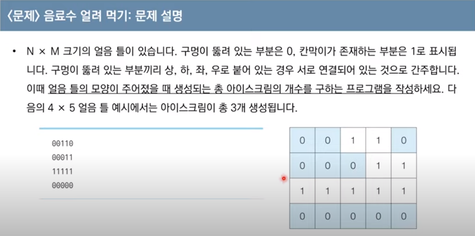
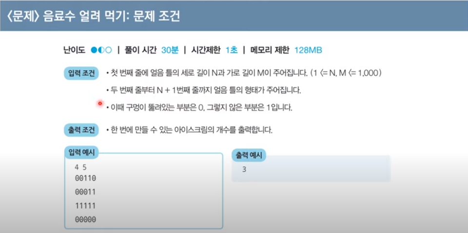
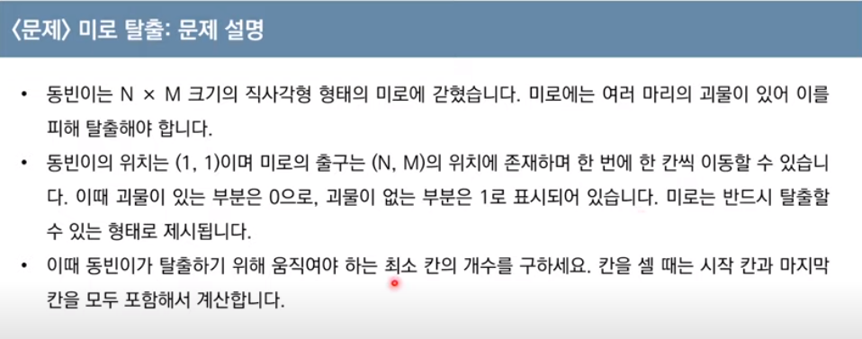
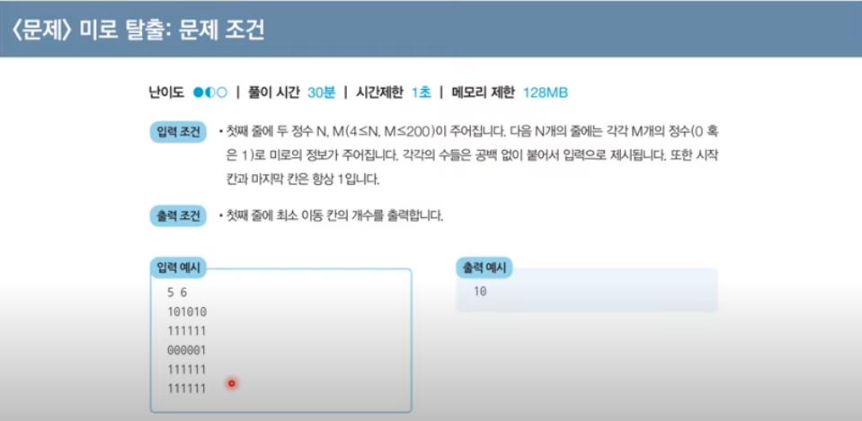

### dfs, 깊이 우선 그래프 탐색 알고리즘

#### 스택
- 먼저 들어온 데이터가 나중에 나가는 선입후출의 자료구조
- 입구와 출구가 동일한 형태로 스택을 시각화 할 수 있다.

#### 큐
- 먼저 들어온 데이터가 먼저 나가는 선입선출의 자료구조
- 큐는 입구와 출구가 모두 뚫려 있는 터널과 같은 형태로 시각화 할 수 있다.

#### 재귀 함수
- 자기 자신을 다시 호출하는 함수

---

> 간단한 예시: 최대 공약수 계산 = 유클리드 호제법 예제
- 두 개의 자연수에 대한 최대공약수를 구하는 대표적인 알고리즘으로는 유클리드 호제법이 있다.
- 두 자연수 A, B에 대해 A를 B로 나눈 나머지를 R이라고 할 때
- A와 B의 최대공약수는 B와 R의 최대공약수과 같다.

유클리드 호제법의 아이디어는 그대로 재귀 함수로 작성 할 수 있다.

```python
# a >= b
def gcd(a, b):
    if a % b == 0:
        return b
    else:
        return gcd(b, a % b)
```

---

### DFS
- 깊이 우선 탐색, 깊은 부분을 먼저 탐색하는 알고리즘이다.
- DFS는 다음과 같은 구조를 그대로 따른다.

1. 탐색의 시작 노드를 스택에 삽입하고 방문처리 한다.
2. 스택의 최 상단 노드에 방문하지 않은 자식 노드가 한 개라도 있다면, 그 노드를 다시 스택에 넣고 방문처리 한다.
3. 자식 노드가 없다면 스택에서 최상단 노드를 꺼낸다.
4. 더 이상 꺼낼 노드가 없을 때 까지 호출한다.

```python
def dfs(graph, v, visited):
    visited[v] = True
    for i in graph[v]:
        if not visited[i]:
            dfs(graph, i, visited)
    
```

---

### BFS
- 너비 우선 탐색, DFS와 달리 아래로 내려가는 형태가 아니라 옆으로 이동하는 형태
- 가까운 노드부터 우선 탐색 하는 것을 말한다.
- 동작은 다음과 같은 구조를 그대로 따른다
1. 탐색 시작 노드를 큐에 삽입하고 방문 처리를 한다.
2. 큐에서 노드를 꺼낸 뒤 자식 노드 중에서 방문하지 않은 노드를 모두 큐에 삽입하고 방문처리를 한다.
3. 더 이상 꺼낼 큐가 없을 때 까지 반복한다.

```python
from collections import deque
def bfs(graph, start, visited):
    queue = deque([start])
    visited[start] = True

    while queue:
        v = queue.popleft()
        for i in graph[v]:
            if not visited[i]:
                queue.append(i)
                visited[i] = True
```

---

> Q1. 음료수 얼려먹기




```python
def ice_cream():
    # map(int, input().split())
    n, m = 4, 5

#    for i in range(n):
#        board.append(list(map(int, input())))
    board = []

    board.append(list(map(int, '00110')))
    board.append(list(map(int, '00011')))
    board.append(list(map(int, '11111')))
    board.append(list(map(int, '00000')))

    result = 0 # 결과, 아이스크림의 갯수

    def dfs(x, y): # 깊이 우선 탐색
        
        # 만약 범위를 벗어나면 False로 dfs 종료
        if x < 0 or x == n or y < 0 or y == m:
            return False

        # 지금 방문 한 칸이 0인 경우
        if board[x][y] == 0:
            board[x][y] = 1 # 이 칸은 방문했으므로 방문처리로서 1로 변경
            dfs(x + 1, y) # 우
            dfs(x - 1, y) # 좌
            dfs(x, y + 1) # 상
            dfs(x, y - 1) # 하
            # 이동하면서 모두 막힘없이 0인 경우에만 True를 return == 모두 0으로 연결 되어 있음
            return True

        # 두 경우 중 어느 경우에도 해당 하지 않는 경우 dfs 종료
        return False

    # N x M 행렬을 돌면서
    for i in range(n):
        for j in range(m):
            
            # 모두 0으로 채워 진 경우에만 결과에 1을 추가
            if dfs(i, j):
                result += 1

    print(result)
```

### 시간 복잡도
- 두 번 반복해 모든 노드를 완전 탐색 하는 인접 행렬 방식의 경우이므로 O(N2) 만큼의 시간 복잡도를 가진다.

---

> Q2. 미로 탈출




```python
def maze():
    from collections import deque
    # map(int, input().split())
    n, m = 5, 6

    #    for i in range(n):
    #        board.append(list(map(int, input())))
    maze = []

    maze.append(list(map(int, '101010')))
    maze.append(list(map(int, '111111')))
    maze.append(list(map(int, '000001')))
    maze.append(list(map(int, '111111')))
    maze.append(list(map(int, '111111')))

    # 이전 implementation(구현) 처럼 이동 할 좌표를 미리 지정한다.
    dx = [-1, 1, 0, 0]
    dy = [0, 0, -1, 1]

    # 너비 우선 탐색
    def bfs(x, y):
        
        # 방문 할 예정인 노드들을 기록하기 위한 queue 선언 및 현재 방문 한 좌표를 넣어준다.
        queue = deque([(x, y)])

        # 방문 할 좌표가 없을 때 까지 = queue가 다 비어 있을 때 까지 수행
        while queue:
            
            # 현재 x, y 좌표를 queue에서 꺼낸다.
            x, y = queue.popleft()

            # 상, 하, 좌, 우 4방향으로 이동 할 예정이므로 4번 반복
            for i in range(4):
                
                # 다음 좌표(next_x, y)가
                nx = x + dx[i]
                ny = y + dy[i]

                # 범위를 벗어나면 무시
                if nx < 0 or nx == n or ny < 0 or ny == m:
                    continue

                # 0인 경우에도 무시
                if maze[nx][ny] == 0:
                    continue

                # 1인 경우에만 다음 좌표의 값을 현재 좌표보다 1 큰 수로 넣어준다.    
                if maze[nx][ny] == 1:
                    
                    # 따라서 다음 좌표는 거리가 1만큼 더 늘었다.
                    maze[nx][ny] = maze[x][y] + 1
                    
                    # 다음 좌표를 탐색 할 것이므로, queue에 다음 좌표를 넣어준다.
                    queue.append((nx, ny))

    # [0, 0] 좌표부터 탐색을 시작한다.                
    bfs(0, 0)
    
    # 탐색이 끝나면 지문처럼 마지막 범위의 거리값을 출력 해 준다.
    print(maze[n - 1][m - 1])
```

### 시간 복잡도
- 자신과 가까운 바로 다음 값 만을 탐색하는 인접 리스트 방식을 사용 할 경우 O(N + E) 만큼의 시간 복잡도를 가지지만,
  - 인접 리스트 방식이 모든 노드를 탐색하는 인접 행렬 방식보다는 효율적이지만, 문제에 따라 구현 방법을 달리한다.


- 이 문제의 경우 어차피 모든 노드를 탐색 해 경로를 지정해야 하므로 O(N2)만큼의 시간복잡도를 가졌다.

---

### DFS / BFS 템플릿
- DFS는 스택 혹은 재귀호출을 이용하고, BFS는 큐를 이용해 구현한다고는 하지만
- 이론은 접어두고 아래의 3가지 경우에 따라 DFS / BFS를 나눠 템플릿으로 사용한다.

### 1. 그래프의 모든 노드를 방문해야 하는 경우
- DFS, BFS 둘 중 어느 것을 사용해도 좋으나
  

- 그래프의 크기가 크면 클 수록 DFS가 유리하고
  - BFS의 경우 가장 가까운 모든 리스트를 다 방문해야 하기 때문이다.


- 그래프의 크기가 작거나 시작 지점부터 멀지 않은 곳에 return이 있다면 BFS가 유리하다
  - DFS의 경우 무조건 가장 깊은 노드까지 탐색하므로, 가장 가까운 곳에 답이 있다면 당연히 BFS가 유리하다.

### 2. 연결 노드간 관계가 있거나(아이스크림 문제), 이동하는 경로에 대해 특징이 있는 경우 DFS를 사용한다.
- BFS는 인접한 노드를 방문 하는 것이 아니라 가장 가까운 것을 우선적으로 찾아가므로
- '인접'의 개념이나 '경로'의 개념을 정의 할 수 없다.

```python
def ice_cream():
    
    # 2차원 배열의 크기를 지정 하거나 지정 받는다.
    n, m = 4, 5

    # 2차원 배열을 지정 하거나 입력 받는다
    board = [[]]

    # 결과
    result = 0

    # 깊이 우선 탐색
    def dfs(x, y):
        
        # 1. 2차원 배열의 범위를 벗어나는 경우에 대한 예외처리가 필요하다.
        if x < 0 or x == n or y < 0 or y == m:
            return False

        # 2. 현재 노드의 특성과 인접 노드의 특성에 따라 분기처리를 해야한다.
        # 이 문제의 경우
        # [1] 노드가 0 일때 이벤트를 실행한다 == 현재 노드의 특성
        if board[x][y] == 0:
            board[x][y] = 1
            dfs(x + 1, y)
            dfs(x - 1, y)
            dfs(x, y + 1)
            dfs(x, y - 1)
            
            # [2] 인접한 모든 노드의 탐색이 완료 된 경우 == 인접 노드의 특성
            return True

        # DFS를 실행하지 않아도 되는 경우 예외처리가 필요하다.
        return False

    # N x M 행렬을 돌면서
    for i in range(n):
        for j in range(m):
            
            # DFS를 '재귀호출' 하면서 실행 할 이벤트를 정의한다. 
            if dfs(i, j):
                result += 1

    print(result)
```

### 3. 최단 거리를 구하는 경우 이거나(미로 탈출 문제), 처음으로 발견되는 특정 값을 찾을 때는 BFS를 사용한다.
- DFS는 최단거리와 관계없이 무조건 가장 깊은 노드까지 탐색하므로 최단 거리의 경우는 무조건 BFS를 사용한다.

```python
def maze():
    
    # 최단거리 이므로 BFS == Queue를 import
    from collections import deque

    # 2차원 배열의 크기를 지정 하거나 지정 받는다.
    n, m = 5, 6

    # 2차원 배열을 지정 하거나 입력 받는다
    maze = [[]]

    dx = [-1, 1, 0, 0]
    dy = [0, 0, -1, 1]

    # 너비 우선 탐색
    def bfs(x, y):
        
        # 방문 할 예정인 노드들을 기록하기 위한 queue 선언 및 현재 방문 한 좌표를 넣어준다.
        # DFS에서 Queue를 사용하지 않는 이유는 어차피 재귀호출을 통해 모든 경우를 다 따져 볼 것이기 때문이다.
        queue = deque([(x, y)])

        # 방문 할 좌표가 없을 때 까지 = 무언가 가까운 곳에 이벤트가 벌어 질 때 까지 == Queue가 다 비어 있을 때 까지 수행
        while queue:
            
            # 현재 x, y 좌표를 queue에서 꺼낸다.
            x, y = queue.popleft()

            # Queue에서 일어나야 할 무언가의 이벤트를 실행한다.
            for i in range(4):
                
                nx = x + dx[i]
                ny = y + dy[i]

                if nx < 0 or nx == n or ny < 0 or ny == m:
                    continue

                if maze[nx][ny] == 0:
                    continue

                if maze[nx][ny] == 1:
                    maze[nx][ny] = maze[x][y] + 1
                    
                    # 방금 Queue에서 꺼낸 이벤트가 종료되면, 항상 다음 방문 할 노드를 Queue에 넣어준다.
                    queue.append((nx, ny))

    # [0, 0] 좌표부터 탐색을 시작한다.
    # DFS와 달리 BFS는 재귀호출 하지 않고 한 번만 실행한다.
    # BFS 내부에서 Queue가 다 떨어 질 때 까지 == 특정 이벤트가 끝날 때 까지 실행한다.
    bfs(0, 0)
    
    # BFS를 통한 탐색이 끝난 경우의 이벤트를 제출한다.
    print(maze[n - 1][m - 1])
```