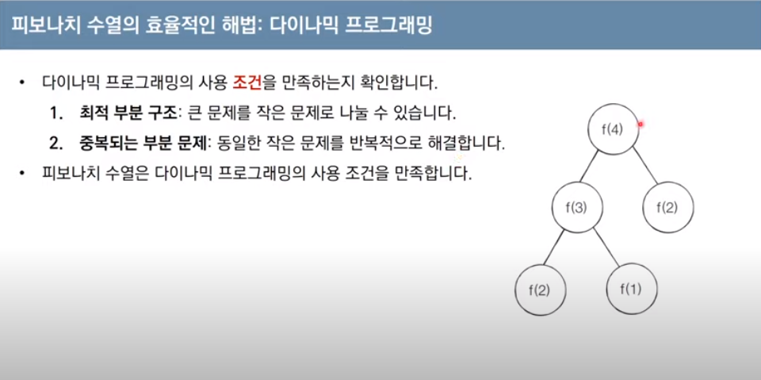
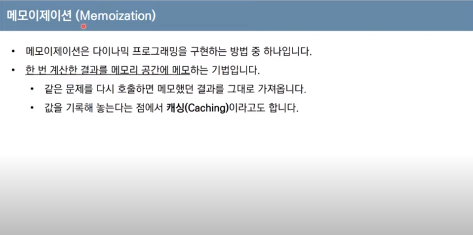
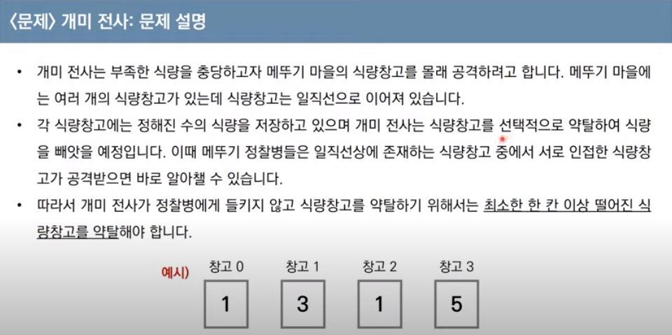
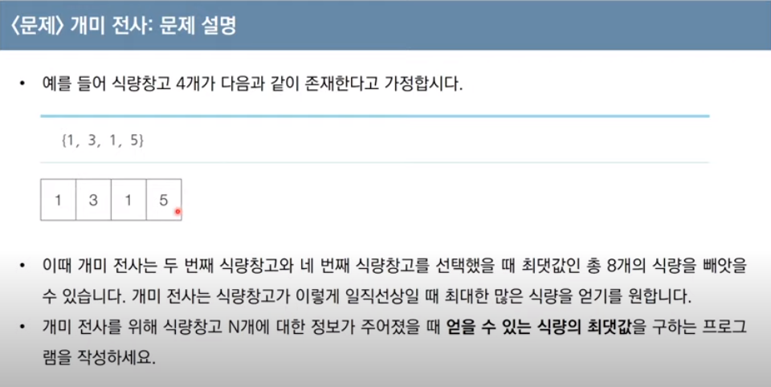
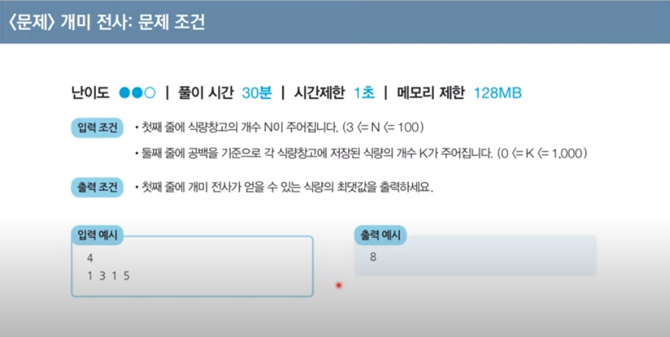

### dynamic programmin, 다이나믹 프로그래밍
#### 메모리를 적절히 사용해 수행시간을 효율적으로 가져가는 방법
- 이미 계산된 결과는 별도의 메모리에 저장 해 다시 계산하지 않도록 하고
- 탑다운(하향식)과 바텀업(상향식) 두 가지 방법으로 구성된다.

### 최적 구분 구조
- 큰 구조를 작은 문제로 나눌 수 있고, 작은 문제의 답을 모아 큰 문제를 해결 할 수 있는 경우

### 중복되는 부분 문제
- 동일한 작은 문제를 반복적으로 호출해야 할 때




다이나믹 프로그래밍은 언뜻 보면 그리디와 유사하나, 그리디보다 더 빠르고 효율적인 해결 방법으로 문제를 풀 수 도 있다.

그리디나 DFS 등의 탐색으로 최적의 값을 구할 수 없을 때 다이나믹 프로그래밍을 고려 해 본다.

> Q1. 개미 전사





```python
def ant():
    n = 4
    arr = [1, 3, 1, 5]

    # 다이나믹 프로그래밍을 위한 임시 배열을 항상 설정한다.
    dp_table = [0] * 100

    # 첫 번째 값에는 입력받은 값의 첫 번째를 넣고,
    dp_table[0] = arr[0]
    
    # 지문에서는 가장 큰 값만 찾으면 되므로 두 값 중 더 큰 값을 두 번째 값으로 넣는다.
    dp_table[1] = max(arr[0], arr[1])

    # 2번 인덱스부터 마지막 인덱스까지 반복하면서
    for i in range(2, n):
        
        # n번째의 양 옆은 탐색 할 수 없으므로, 현재 인덱스와 -2 만큼의 인덱스 // 1번째 전의 인덱스를 비교 해 큰 값을 넣는다.
        dp_table[i] = max(dp_table[i] + dp_table[i - 2], dp_table[i - 1])

    print(dp_table[n-1])
```


