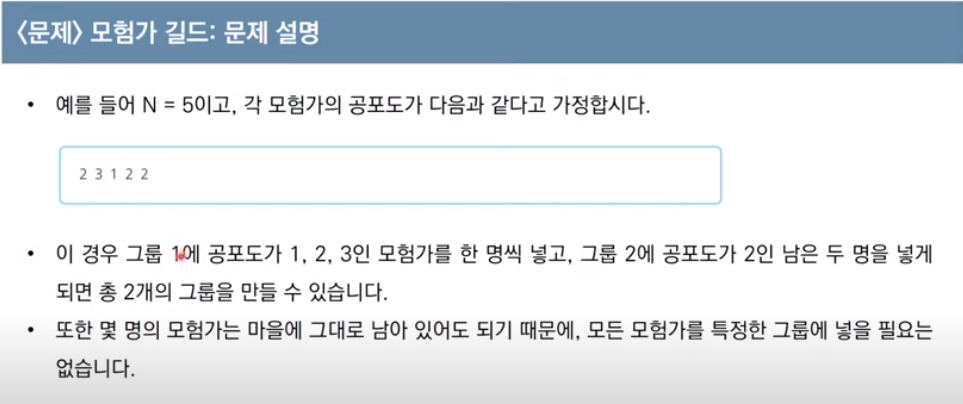

### Greedy, 그리디 알고리즘
#### 현재 상황에서 가장 효율적인, 가장 좋은 것 만 선택하는 방법

일반적인 그리디 알고리즘은 문제를 풀기위한 최소한의 아이디어를 떠올릴 수 있는 능력을 요구한다.

따라서 그리디 해법은 *정당성 분석*이 중요하다.
- **정당성 분석** : 단순히 가장 좋아보이는 것을 반복적으로 선택해도, 최적의 값을 구할 수 있는지 검토하는 것

> Q1. 루트 노드부터 시작해, 거쳐가는 노드 값의 합을 최대로 만들고 싶다.
> 
> 다음 상황에서 가장 최적의 값은 무엇인가?
> A1. 5 - 7- 9
 


이처럼 그리디 알고리즘은 문제 상황에서 최적화 된 값만 찾아가는 것이다.


> Q2. 거스름 돈 문제


### 거스름 돈 문제의 문제해결 아이디어
- 최적의 값을 빠르게 구하기 위해서는 가장 큰 화폐 단위부터 돈을 거슬러 주면 된다.
- N원을 거슬러 줘야 할 때, 가장 먼저 500원으로 거슬러 줄 수 있을 만큼 거슬러 준다.
- 이후 100, 50, 10원 차례로 거슬러 주면 가장 최소한의 동전 갯수로 거슬러 줄 수 있다.

```python
def input(input):
    money = input # 최초로 입력 받은 돈이자, 앞으로 거슬러 준 후의 돈
    list = [500, 100, 50, 10] # 동전 목록
    result = 0 # 거슬러 준 동전 갯수
    for l in list: # 동전 목록에서 반복
        result += money // l # 한 번 거슬러 줄 때마다 결과에 횟수 + 1
        money %= l #남은 돈은 목록에서 거슬러 준 나머지를 대입
    print(result) # 거슬러 준 횟수를 출력

if __name__ == '__main__':
    input(1260)
```

> 시간 복잡도

- 화폐의 종류가 K라고 할 때, 이 코드의 시간 복잡도는 O(K)이다.
- 이 알고리즘의 시간 복잡도는 금액과는 무관하고, 동전의 총 종류에만 영향을 받기 때문이다.

> Q3


```python
# 내가 푼 방법
def until_one(N, K):
    result = 0 # 시행 횟수는 최초 0이다.
    while N != 1: # N이 1이 될 때 까지 반복문을 돌린다.
        if N % K == 0: # 만약 나누어 떨어진다면
            N = N // K # 몫을 다시 N에 넣고
            result += 1 # 시행횟수를 한 번 올린다.
        else: # 나누어 떨어지지 않는다면
            N -= 1 #지문처럼 1을 빼고
            result += 1 # 시행횟수를 1 올린다.

    print(result)

# 이코테의 풀이
def ecote_until_ond(n, k):
    count = 0 # 시행횟수는 최초 0
    while True: # 반복문을 시행
        target = (n // k) * k # n이 k로 나누어 떨어질 수 있는 값을 먼저 찾는다.
        count += (n - target) # n이 target까지 도달 할 수 있을 때 까지 -1을 해 준다, 이 경우 17이 16이 될 때 까지의 연산
        n = target # 이 과정을 통해 n은 한 번에 나누어 떨어지는 수가 된다.
        
        if n < k: # n이 더이상 k로 나누어 질 수 없다면 반복을 끝낸다.
            break
        
        count += 1 #시행 횟수를 한 번 추가하고
        n //= k #현재 n은 한 번에 나눌 수 있으므로 지문처럼 2번 방법을 통해 n을 k로 나눈다.
        
    count += (n - 1)
    print(count)
```

> 시간 복잡도

- 내가 푼 방법은 한 번 반복 할 때마다 누적되므로 O(n) 만큼의 시간 복잡도를 가진다.
- 이코테에서 푼 방법은 random access는 불가능하고 O(n)만큼 반복하는게 아닌 데이터가 증가 할 때마다 단계가 늘어나므로 O(logN)의 시간 복잡도를 가진다.

> Q4


```python
def multi_or_plus(input):
    arr = list(input) # 문자 배열을 list로 만들고
    arr.sort(reverse=True) # 가장 큰 수부터 오름차순 정렬
    result = int(arr[0]) # 출력값의 첫 번째를 지정학
    for a in range(1, len(arr)): # 1번째 인덱스부터 반복한다.
        if int(arr[a]) >= 2: # 2 이상 일 경우에만 곱하고
            result *= int(arr[a])
        else: # 1, 0은 곱하면 손해이므로 더한다.
            result += int(arr[a])

    print(result)
```

> 시간복잡도
- 반복하는 횟수만큼 이므로 O(N)의 시간복잡도를 가진다.

> Q5





```python
# 내가 푼 풀이
def guild(N, input): # 입력값을 두 개를 받지만, 사실 N은 불필요 하다.
    members = list(map(int, input.split(' '))) 
    members.sort(reverse=False) # 공포도 목록을 작은 순서대로 정렬 후
    result = 0

    for m in members: # 공포도를 돌면서
        if members.count(m) >= m: # 해당 공포도의 값 이상 인 사람들의 수를 세어서
            result += 1 # 해당 멤버가 포함되면 그룹을 한 개 결성하고
            del members[0: m] # 그룹을 결성 한 멤버를 삭제하면 된다.

    print(result)

# 이코테의 풀이

n = int(input())
data = list(map(int, input().split()))
data.sort()

result = 0 # 총 그룹의 수
count = 0 # 현재 그룹에 포함된 모험가의 수

for i in data: # 공포도를 낮은 것 부터 하나씩 확인하며
    count += 1 # 현재 그룹에 해당하는 모험가를 포함시킨다.
    if count >= i: # 현재 그룹에 포함된 모험가의 수가 현재의 공포도 이상이라면, 그룹 결성
        result += 1 # 총 그룹의 수 증가시키기
        count = 0 #현재 그룹에 포함 된 모험가의 수 초기화

print(result)
```

> 시간 복잡도
- 입력받은 공포도 배열에서 한 번 반복 이후 줄어드는 배열 크기만큼 반복 횟수가 줄어들기 때문에 O(logN) 만큼의 시간 복잡도를 가진다.

> 그리디 템플릿
- 그리디 알고리즘은 매 번 가장 효과적인 방법을 찾아 구현하는 방식을 채택하므로, 템플릿을 정의 할 수 없다.
- 따라서 이코테의 강의 문제에서 사용 된 일부 기법과 특정 상황에서 사용하면 좋은 아이디어를 소개한다.

> input의 범위와 값이 확실 할 때는 배열로 정의해서 사용한다.
- 거스름 돈 문제의 경우 동전의 목록이 항상 고정되어 사용되므로, 미리 정의 해 놓고 사용한다.
```python
money_group = [500, 100, 50, 10]
```

> 몫과 나머지를 이용한 연산에서 바로 나누어 떨어지는 값을 찾을 때는 나머지에 몫을 곱한다.
- 1이 될 때 까지 문제의 경우 단번에 나누어 떨어지는 값을 찾아야 하므로, 몫에 대상값을 곱하면 바로 나누어 떨어지는 수를 찾을 수 있다.
```python
target = (대상 값 // 나눌 값) * 나눌 값 # 몫은 한 번 이상 나눈 수이므로, 나눌 값을 곱하면 target은 항상 한 번에 나누어 떨어지는 값이 된다.
```

> 배열을 순회 할 때 한 번 사용되고 이후에 사용되지 않는다면, 소거하는 편이 빠르다
- 모험가 길드 문제에서 한 번 그룹으로 지정 된 사람들과 나머지 사람들은 더 이상 필요하지 않으므로, 배열에서 제거하면 훨씬 빨리 배열을 순회할 수 있다.
```python
members = [1, 2, 2, 2, 3]
result = 0
for m in members:
        if members.count(m) >= m:
            result += 1
            del members[0: m] # 더 이상 필요없는 요소를 상황에 맞게 삭제
```


