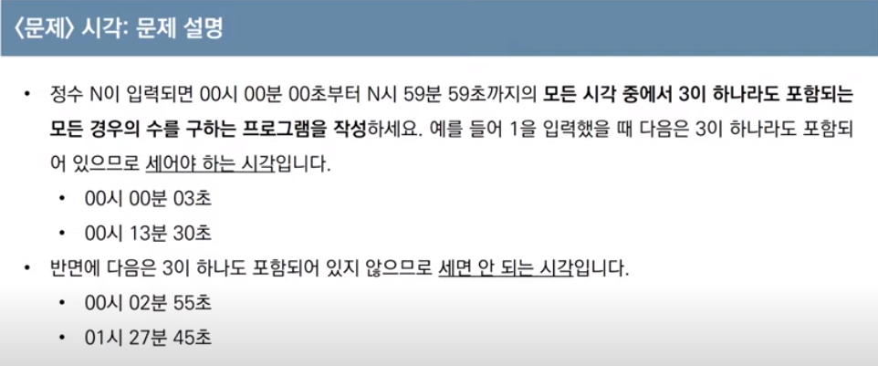

### Implementation, 구현
#### 시뮬레이션과 완전탐색

완전탐색의 의미는 모든 배열을 순회하는 의미의 완전탐색이 아니라, 2차원 배열 내 좌표를 모두 돌아다니는 것을 의미한다.

---

> Q1. 상하좌우


```python
def imp1(n, input):

    direction = ['L', 'R', 'U', 'D'] # 방향을 지시하는 문자열과
    dx = [0, 0, -1, 1] # 각 방향마다 +- 할 좌표의 움직임을 배열에 담는다.
    dy = [-1, 1, 0, 0]
    x, y = 1, 1 # 시작 좌표도 정한다.
    walk = input.split()

    for w in walk: # 내 이동방향을 돌면서
        for d in range(len(direction)): # 방향 목록중에
            if w == direction[d]: # 해당하는 방향이 나오면
                new_dx = x + dx[d] # 미리 설정한 좌표만큼 더해준다.
                new_dy = y + dy[d]
        # 그러나 밖을 벗어나거나, 더 이상 물러 날 수 없을 때는 넘어간다.        
        if new_dx > n or new_dx < 1 or new_dy > n or new_dy < 1:
            continue
        # 새로운 좌표를 기존의 좌표에 대입한다.    
        x, y = new_dx, new_dy

    print(x, y)
```

### 시간 복잡도
- 입력받은 N만큼, 그리고 돌아야 하는 방향만큼 2중 중첩의 반복을 순회해야 하므로 O(N2) 만큼의 시간 복잡도를 가진다.

---

> Q2. 시각




```python
def time(n):
    result = 0 # 3이 나타난 횟수
    for h in range(n + 1): # 시간은 0시부터 n시까지
        for m in range(60): # 분, 초는 0부터 59까지
            for s in range(60): # 3이 포함되어 있으면
                if '3' in str(h) or '3' in str(m) or '3' in str(s):
                    result += 1 # result += 1
    print(result)
```

### 시간복잡도
- 입력값 N이 모든 시, 분, 초에 고정되어 있었다면 O(N3) 만큼의 시간 복잡도를 가진다.

---

> Q3. 왕실의 나이트


```python
def knight(input):
    result = 0 # 이동 한 횟수
    # 상우, 우상, 우하, 하우, 하좌, 좌하, 좌상, 상좌에 해당하는 좌표 이동 값
    direction = [(1, 2), (2, 1), (2, -1), (1, -2), (-1, -2), (-2, -1), (-2, 1), (-1, 2)]
    
    # 가져오는 값의 첫 번째는 문자이므로, 딕셔너리를 통해 위치를 매핑
    replace_direction = {'a' : 1, 'b' : 2, 'c' : 3, 'd' : 4, 'e' : 5, 'f' : 6, 'g' : 7, 'h' : 8}
    x, y = replace_direction[list(input)[0]], int(list(input)[1])

    for d in range(len(direction)): # 모든 방향을 돌면서
        
        # 새로운 x, y 좌표를 각각 더해준다.
        new_dx, new_dy = x + direction[d][0], y + direction[d][1]
        
        # 이전 완전탐색과는 다르게 8x8 배열 안에서 막히는 곳 없이 모두 해당하는 조건만 count해야 한다.
        if 1 <= new_dx <= 8 and 1 <= new_dy <= 8:
            result += 1

    print(result)
```
### 시간 복잡도
- 입력값과 무관하게 정해진 direction 안에서만 순회하므로 O(1)의 시간복잡도를 가진다.

---

> Q4. 문자열 재정렬


```python
def replacement(input):
    visited = [] # 문자열을 담고, 정렬 할 배열 생성
    sum = 0 # 숫자 합계를 담을 배열 생성
    for i in input: # 들어오는 문자열을 순회하면서
        if i.isalpha(): # 만약 문자열이면
            visited.append(i) # 빈 배열에 문자열을 대입
        else: # 숫자라면 sum에 합계를 추가
            sum += int(i)
    visited.sort() # 문자열을 오름차순으로 정렬하고
    visited.append(str(sum)) # 숫자를 문자형으로 바꿔 배열에 넣어 준 다음
    
    print(''.join(visited)) # 하나의 문자로 출력 해 준다.
```
### 시간 복잡도
- 받아오는 input의 길이만큼 반복하므로 O(N)만큼의 시간 복잡도를 가진다. 

### 구현 템플릿
- 구현 템플릿은 좌표연산과 배열의 입출력, 치환을 고정 템플릿으로 사용한다.

```python
# N x N 행렬에서 한 칸씩 움직 일 때는 아래 템플릿을 고정으로 사용한다.
def imp1():
    
    # 입력값 n은 범위, walk는 방향정보
    n = 5
    walk = ['R', 'R', 'R', 'U', 'D', 'D']

    direction = ['L', 'R', 'U', 'D'] # 방향을 지시하는 문자열
    dx = [0, 0, -1, 1] # 각 방향마다 +- 할 좌표의 움직임
    dy = [-1, 1, 0, 0] # 문제에서 주는 x, y축 == 가로, 세로 축을 알아서 설정한다.
    x, y = 0, 0 # 시작 좌표.

    for w in walk: # 정해진 이동 방향을 돌면서
        for d in range(len(direction)): # 방향 목록중에
            if w == direction[d]: # 해당하는 방향이 나오면
                new_dx = x + dx[d] # 미리 설정한 좌표만큼 더해준다.
                new_dy = y + dy[d]
                
        # 밖을 벗어나거나, 더 이상 물러 날 수 없을 때는 넘어간다.        
        if new_dx > n or new_dx < 1 or new_dy > n or new_dy < 1:
            continue
        # 새로운 좌표를 기존의 좌표에 대입한다.    
        x, y = new_dx, new_dy

    print(x, y)
```
```python
# 왕실의 나이트 문제의 경우 1칸 씩 이동하는게 아닌, 이동 범위가 주어 진 경우 직접 할당한다.
# 상우, 우상, 우하, 하우, 하좌, 좌하, 좌상, 상좌에 해당하는 좌표 이동 값
direction = [(1, 2), (2, 1), (2, -1), (1, -2), (-1, -2), (-2, -1), (-2, 1), (-1, 2)]

# 이 후 한 칸씩 이동하는 형태와 같이 이동하는 좌표와 범위 연산을 수행한다.
```
```python
# 문자인지 숫자인지 체크하는 isalpha()는 문자 + 숫자가 혼합된 문자열 처리에서 유용하다.
# ord(문자)는 문자에 해당하는 유니코드 정수를,
# chr(정수)는 문자에 해당하는 유니코드 문자를 반환하므로 이 또한 문자열 처리에서 유용하다.
# 문자열 연산이나 탐색의 경우, 탐색 한 문자열을 담을 수 있는 배열을 선언한다.
def replacement():
    # 입력받는 input은 문자와 숫자의 혼합이다.
    input = '1KK23PD'
    
    visited = [] # 문자열을 담고, 정렬 할 배열 생성
    
    for i in input: # 들어오는 문자열을 순회하면서
        
        # some logic
        # cur_node =  ord(i) # 문자에 대응하는 숫자가 필요하다면
        # cur_node =  chr(i) # 숫자에 대응하는 문자가 필요하다면
        
        if i.isalpha(): # 만약 문자열이면
            visited.append(i) # 빈 배열에 문자열을 대입
            # visited.pop() # pop, insert, del 등의 배열 입출력 연산을 이용한다.
        else:
            # some logic
            continue
```