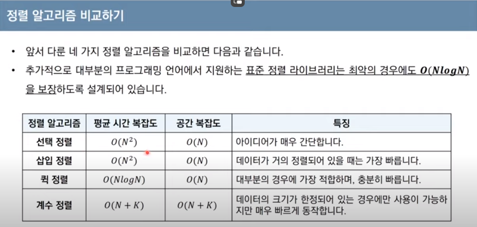

### 정렬
#### 정렬이란 데이터를 특정한 기준에 따라 순서대로 나열하는 것.

---

#### 선택정렬
- 처리되지 않은 데이터 중 가장 작은 데이터를 선택 해 맨 앞에 있는 데이터와 바꾸는 것

```python
arr = [7, 5, 9, 0, 3, 1, 6, 2, 4, 8]

for i in range(len(arr)):
    cur_node = i # 현재 값이자 가장 작은 값
    for j in range(i + 1, len(arr)): # 다음 값 부터 반복하면서
        if arr[cur_node] > arr[j]: # 현재 값보다 더 작은 값이 나오면
            cur_node = j # 더 작은 값을 변경
    arr[i], arr[cur_node] = arr[cur_node], arr[i] # 현재 값을 가장 작은 값으로 변경
    
print(arr)
```
#### 이 때 시간 복잡도는 O(N2) 이다.

---

#### 삽입정렬
- 처리되지 않은 데이터를 하나씩 골라서 적절한 위치에 삽입한다.
- 일반적으로 선택정렬보다 더 빠르게 동작한다.

```python
arr = [7, 5, 9, 0, 3, 1, 6, 2, 4, 8]

for i in range(1, len(arr)): # 첫 번째는 정렬되었다고 판단하고, 다음 값 부터 정렬 시작
    for j in range(i, 0, -1): # 다음 값 부터 뒤로 이동하면서 탐색
        if arr[j] < arr[j - 1]: # 만약 왼쪽 값이 현재 값 보다 크다면
            arr[j], arr[j - 1] = arr[j - 1], arr[j] # 두 값의 위치를 바꿔주고
        else: # 현재 값이 더 작다면 넘어간다.
            break
```
#### 이 때 시간 복잡도는 O(N2)이나, 거의 정렬 된 최선의 경우 O(N)으로 동작한다.

---

### 퀵 정렬
- 기준 데이터를 설정하고, 그 기준보다 큰 데이터와 작은 데이터의 위치를 바꾸는 방법

```python
arr = [7, 5, 9, 0, 3, 1, 6, 2, 4, 8]


def quick_sort(arr, start, end):
    if start >= end: # 원소가 한 개일 경우에는 멈춤
        return

    pivot = start # 시작 값을 분할기점으로 지정하고
    left = start + 1 # 다음 값을 비교 시작 값으로
    right = end # 마지막 값을 비교 끝 값으로 정한다.

    # 분할 할 때까지 반복한다.
    while left <= right:
        
        # 피벗보다 큰 값을 찾을 때 까지
        while left <= end and arr[left] <= arr[pivot]:
            left += 1 # 왼쪽 값을 오른쪽으로 이동시킨다.
            
        # 피벗보다 작은 값을 찾을 때 까지    
        while right > start and arr[right] > + arr[pivot]:
            right -= 1 # 오른쪽 값을 왼쪽으로 이동시킨다.
            
        # 만약 두 값이 엇갈렸다면   
        if left > right:
            # 가장 작은 값과 피벗을 바꾸고
            arr[right], arr[pivot] = arr[pivot], arr[right]
        
        # 엇갈리지 않고 찾았으면    
        else:
            # 가장 작은 값과 큰 값을 바꾼다.
            arr[left], arr[right] = arr[right], arr[left]
    
    # 분할 이후 왼쪽, 오른쪽에 대해 각각 정렬을 수행한다.        
    quick_sort(arr, start, right - 1)
    quick_sort(arr, right + 1, end)
    
quick_sort(arr, 0, len(arr) - 1)
```
```python
arr = [7, 5, 9, 0, 3, 1, 6, 2, 4, 8]
def quick_sort(arr):
    if len(arr) <= 1: # 원소가 한 개 이하라면
        return arr # 정렬이 필요하지 않다.
    
    pivot = arr[0] # 입력 배열의 첫 번째 값을 피벗으로 지정하고
    new_arr = arr[1:] # 나머지 값들을 새로운 배열로 만든다.

    left_arr = [l for l in new_arr if l <= pivot] # 왼쪽은 피벗보다 작은 값 들로,
    right_arr = [r for r in new_arr if r > pivot] # 오른쪽은 피벗보다 큰 값들로 배열을 새로 만들고

    # 위 3 배열을 하나로 합쳐서 각각의 방향에 대해 퀵정렬을 수행하면 된다.
    return quick_sort(left_arr) + [pivot] + quick_sort(right_arr)   
```
#### 퀵 정렬은 일반적으로 O(N log N)의 시간복잡도를 가지지만 최악의 경우 O(N2)의 시간 복잡도를 가진다.

#### 계수정렬
- 특정 조건이 부합 할 때만 사용 할 수 있지만 가장 빠르게 동작하는 정렬
- 계수정렬은 데이터의 크기 범위가 제한되어 정수 형태로 표현 할 수 있을 때 사용 가능하다.
- 데이터의 갯수가 N, 데이터 중 최대값이 K일 때, 최작의 경우에도 수행시간 O(N + K)를 보장한다.

```python

arr = [7, 5, 9, 0, 3, 1, 6, 2, 9, 1, 4, 8, 0, 5, 2]

count = [0] * (max(arr) + 1) # 모든 범위를 포함하는 리스트를 선언한다.

for i in range(len(arr)): # 입력받은 배열을 돌면서
    count[arr[i]] += 1 # 인덱스에 해당하는 값을 1씩 올려준다.
    
for i in range(len(count)): # 범위 리스트를 돌면서
    for j in range(count[i]): # 범위 리스트 내 원소를
        print(i, end=' ') # 정해진 갯수만큼 출력한다.
```
